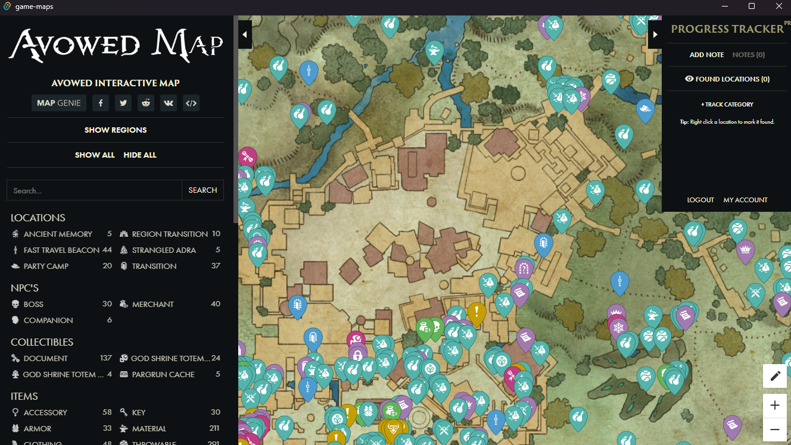

# Game Maps App

Welcome to **Game Maps**, an interactive tool for gamers to explore detailed maps powered by [Map Genie](https://mapgenie.io), with ads removed and pro features like unlimited save locations unlocked. I’m LongHT, a developer currently seeking new job opportunities, and I built this app for **Windows** as a passion project to showcase my skills—contributions welcome to expand it to other platforms!

## Features

- **Interactive Maps**: Integrates with [Map Genie](https://mapgenie.io) for fan-made, detailed game maps.
- **Ad-Free Experience**: No distractions—just pure map exploration.
- **Pro Features Unlocked**: Unlimited save locations to track all your in-game discoveries.
- **Sync Progress**: Seamlessly sync saved locations with Map Genie’s website.
- **User-Friendly Design**: Intuitive interface designed with gamers in mind.

## Installation

### Windows
1. **Download**:
   - Get the latest release from [Releases](#) (link TBD).
   - Or clone this repo and build it yourself (see [Building from Source](#building-from-source)).
2. **Install**:
   - Run `GameMapsSetup.exe` (or equivalent) and follow the prompts.
3. **Launch**:
   - Start the app, connect your Map Genie account (optional), and dive in!

### Other Platforms
- **Android, iOS, macOS, Linux**: In progress! I’d love help porting this—see [Contributing](#contributing).

## Usage

1. **Pick a Game**: Select from games supported on [mapgenie.io](https://mapgenie.io).
2. **Explore**: Find collectibles, quests, and more on interactive maps.
3. **Save Freely**: Mark unlimited locations with pro features enabled.
4. **Ad-Free Bliss**: Focus on gaming without interruptions.

## Building from Source
(TBD)

## Contributing
I’m actively looking for work and would love collaborators to grow this project! Especially seeking help with:
- Porting to Android, iOS, macOS, or Linux.
- Enhancing features or fixing bugs for Windows.
- Open to ideas—let’s build something great together!

## Hiring Me?
I’m an unemployed developer eager to join a team where I can apply my skills in mobile, full-stack, blockchain. This project demonstrates my initiative and coding chops. If you’re hiring, please reach out at https://linktr.ee/huynh.thanh.long — I’d love to chat about how I can contribute to your team!

## License
(TBD)

## Acknowledgments
- Crafted with ❤️ by LongHT, job hunting and coding in the meantime.
- Thanks to Map Genie for the amazing map data.

## Support
- Questions or opportunities? Open an [issues](https://github.com/longht021189/game-maps/issues) here or email me at [LinkTree](https://linktr.ee/huynh.thanh.long).
- Happy gaming—and here’s to new adventures, in games and my career! 🎮